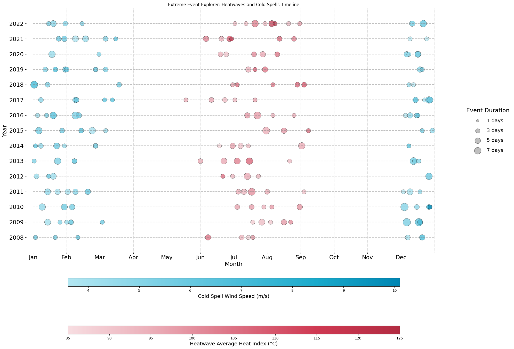

# Representative Meteorological Year (RMY) Generator

Anomaly-driven generation of Representative Meteorological Year (RMY) weather files with embedded extreme events, including **heat waves** and **cold spells**.

## Overview

This repository provides tools to detect and integrate extreme climate events into typical meteorological year (TMY) weather files. It uses a combination of static thresholds, percentile detection, GNN-style anomaly detection, and Extreme Value Theory (EVT) to create robust event-driven RMY files.

## Features

- Multi-method detection of heatwaves and cold spells
- Integration of extreme days into a base TMY to generate a new RMY
- Seasonal averaging and mild-day insertion for balance
- Compatible with EnergyPlus `.epw` weather files
- Outputs ready-to-use CSV summaries and RMY EPW

## Structure

```
RMY_Github/
├── rmy/
│   ├── coldspells.py
│   ├── heatwaves.py
│   ├── rmy_generation.py
│   ├── utils.py
│   └── __init__.py
├── examples/
│   └── example_usage.ipynb
├── data/
│   └── .gitignore
├── images/
│   └── event_timeline.png
├── requirements.txt
├── LICENSE
└── README.md
```

## Example Output

This timeline visualizes detected heatwaves and cold spells across multiple years:



## Usage

See the notebook in `examples/example_usage.ipynb` for a full walk-through.

## Requirements

```bash
pip install -r requirements.txt
```

## Citation

If you use this tool, please cite the following publication:

**Tarkhan, N., Crawley, D. B., Lawrie, L. K., & Reinhart, C. (2025).**  
*Generation of representative meteorological years through anomaly-based detection of extreme events.*  
Journal of Building Performance Simulation.  
[https://doi.org/10.1080/19401493.2025.2499687](https://www.tandfonline.com/doi/full/10.1080/19401493.2025.2499687?src=exp-la)

## License

This project is licensed under the MIT License.