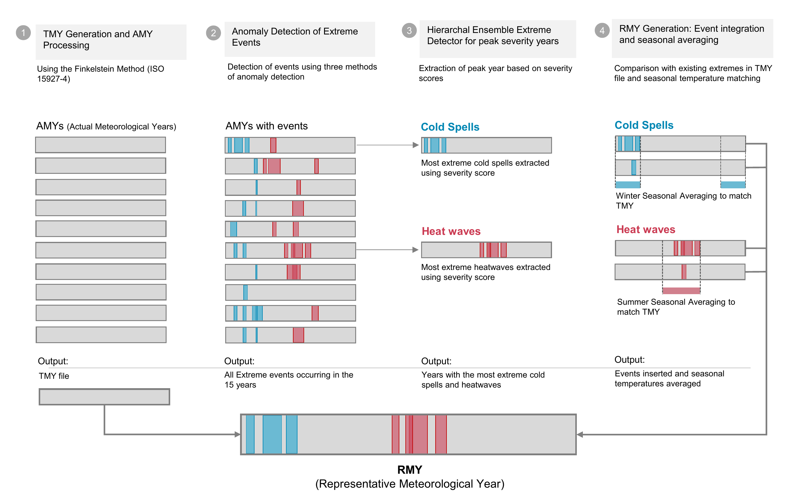

# Extreme-Aware Meteorological Years: Generating RMYs and FRMYs

## Motivation

TMY weather files represent averaged conditions and hence do not represent the full spectrum of extremes, which are critical to assessing thermal resilience, peak loads, overheating, and grid reliability under climate stress. This project corrects for that by embedding realistic extreme events—both historical and future—into weather files that are fully compatible with building simulation tools like EnergyPlus, ClimateStudio, Rhino/Grasshopper, and more.

## Key Components

- **RMYs (Representative Meteorological Years):** Weather files embedded with observed extreme events, generated from historical AMY data using anomaly detection.
- **FRMYs (Future Representative Meteorological Years):** Morphed weather files embedding future heatwaves and cold spells derived from climate emulator trajectories with annual resolution and embedded uncertainty.
- **Anomaly Detection:** Ensemble method combining static thresholds, GNN-based detection, and EVT (Peaks Over Threshold) to identify peak years.
- **Event Smoothing & Integration:** Temporal smoothing and seasonal averaging logic that inserts extremes while preserving monthly averages.

## Methodology

This toolkit introduces a multi-method event detection and integration pipeline for constructing Representative Meteorological Year (RMY) and Future RMY (FRMY) weather files. These new formats restore historically observed or projected extremes into standard TMY files to enable realistic simulation for overheating, thermal resilience, peak demand, and mortality-linked risk.

## Methods Used

- **Static Thresholding:** Identifies extremes based on fixed temperature or percentile thresholds.
- **GNN-Based Anomaly Detection:** Flags events using graph-based representations of temporal temperature anomalies.
- **Extreme Value Theory (EVT):** Extracts statistically rare extremes using Peaks Over Threshold (POT) modeling.

Each method is used in a complementary ensemble to identify the most severe year and characteristic events.

## Workflow Summary

Detect peak heatwaves and cold spells across 15+ years of EPW files.  
Match extreme events to base-year dates using overlap logic.  
Replace those dates with extreme-event days from the most severe year, using smoothing.  
Rebalance monthly averages by inserting non-extreme days to maintain realism.  

### Extreme Events Explorer (EEE)


---

## Folder Structure

```
data/
├── base/               ← base TMY EPW file (1 file only)
├── epws/               ← AMY files for detection
├── RMY/                ← output folder for RMY EPWs
├── FRMY/               ← output folder for FRMY EPWs
├── final/              ← stores output RMY + stats
├── images/             ← visualization assets (map.gif, EEE)
```

---

## Explore the Interactive Map


Click below to explore an interactive dashboard where you can download RMY and FRMY weather files for cities worldwide:

👉 [Explore the Map here](https://svante.mit.edu/~pgiani/buildings/)

---

## Usage

Install required packages:

```bash
pip install -r requirements.txt
```

Then run the following from the repo root:

```python
from rmy import run_full_rmy_pipeline
```

Make sure your folder structure matches:

```
EPWs/base/ → contains the base TMY file (1 file only)
EPWs/epws/ → contains full set of AMY EPWs
final/     → RMY weather file + event summaries will be saved here
```

## Try it on Google Colab

[](https://colab.research.google.com/github/Nadatarkhan/RMY/blob/main/examples/RMY_Generation_Colab.ipynb)

---

## Citations

Tarkhan, N., Crawley, D., Lawrie, L., & Reinhart, C.  
**Generation of representative meteorological years through anomaly-based detection of extreme events.**  
*Journal of Building Performance Simulation, 2025.*  
[https://doi.org/10.1080/19401493.2025.2499687](https://doi.org/10.1080/19401493.2025.2499687)

Giani, P., Gehlen, B., Nearing, G., et al.  
**Origin and Limits of Invariant Warming Patterns in Climate Models.**  
*arXiv preprint, 2024.*  
[https://arxiv.org/abs/2411.14183](https://arxiv.org/abs/2411.14183)

Tarkhan, N., & Reinhart, C.  
**Representing Climate Extremes: An Event-driven Approach to Urban Building Performance Assessments.**  
*Comfort at the Extremes Conference, Seville, 2024.*  
[View PDF](https://drive.google.com/file/d/14Kj9-jcL_SQGUaTvbdAzLVPOJHHWHLz0/view?usp=sharing)

---

## License

This repository is released under the MIT License.
